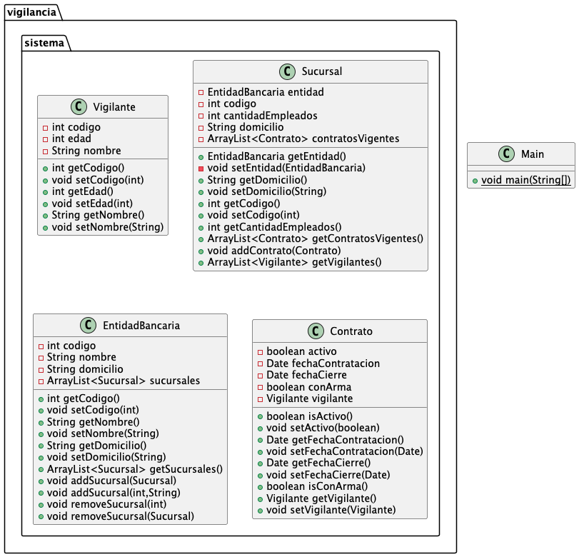

# Sistema de gestión de Vigilancia para Sucursales Bancarias

## TODO Sistema de Vigilancia
- [x] Definir las caracteristicas de la entidad bancaria
- [x] Definir las caracteristicas de la surcursal
- [x] Agregar campos de codigo y domicilio
- [x] Agregar las caracteristicas de la entidad Contrato
- [x] Agregar las caracteristicas del Vigilante
- [x] Vincular al vigilante con el contrato
- [x] Dar de alta contratos para ver vigilantes de la sucursal
- [ ] Buscar el indice de la sucursal a borrar
- [ ] Vincular sucursales con banco

# Sistema de gestión del Torneo Davinci

## TODO Torneo DV
- [x] Agregar estructura de clase de Player
- [x] Agregar estructura de clase de Team sin Player
- [x] Establecer la relación entre Team y Player
- [x] Agregar estructura de clase de Match sin Team
- [x] Actualizar estructura de clase Match con Team
- [x] Establecer la relación entre Team y Match
- [x] Agregar estructura de clase de Season
- [x] Establecer la relación entre Team y Season
- [x] Establecer la relación entre Season y Match
- [x] Crear 11 jugadores y asignar a un equipo
- [x] Crear 11 jugadores y asignar a un equipo
- [x] Crear un match entre dos equipos
- [x] Agregar nuevos jugadores desde la clase Team
- [ ] Modificar el resultado del equipo local y visitante
- [ ] Obtener al equipo que gana el Match
